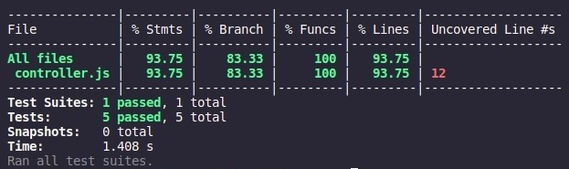

## <div align="center"> DESAFIO 180 SEGUROS


</div>


## Resumo do projeto

Neste projeto, foi desenvolvido um desafio técnico da empresa 180 Seguros em parceria com a Laboratória. Nele, a criação do _endpoint_ GET na API (_Application Programming Interface_ -  Interface de Programação de Aplicação) da 180 foi realizado. O objetivo principal consiste em solucionar um problema do nosso cliente. Eles, solicitaram uma nova rota, dentro do nossa API já existente, onde seja possível buscar um segurado, previamente cadastrado, utilizando o campo de ID. Ou seja, o desafio consiste em: Criar o _endpoint_ GET. Caso o segurado exista, retornar os dados do mesmo com o código HTTP 200, e, caso o segurado não exista, retornar o código HTTP 404 e com o corpo (_body_) vazio.


## Organização

Antes de iniciar o projeto, foi criado um fluxograma para visualizar com excelência as etapas de desenvolvimento do mesmo, incluindo o planejamento de tarefas e objetivos utilizando o Trello, seguindo uma sequência lógica de estudos e tomada de decisões.

* Fluxograma:


* Trello: 


## Rodando a aplicação pela primeira vez

Para visualizar o resultado deste desafio, siga as etapas abaixo. Certifique-se de ter o [Git](https://git-scm.com/), [NodeJS](https://nodejs.org/) e o [NPM](https://www.npmjs.com/) instalados.

Passo 1: Execute o seguinte comando para clonar o repositório na sua máquina:

```bash
git clone https://github.com/PolyanaCristinaFeitoza/Desafio-180S.git
```

Passo 2: Acesse a pasta raiz do projeto:

```bash
cd laboratoria-180
```

Passo 3: Em seguida, instale as dependências do projeto:

```bash
npm install
```

Passo 4: Inicie a API com o seguinte comando:

```bash
npm start
```

Se tudo ocorrer corretamente, você verá a mensagem Desafio Laboratoria <> 180 Seguros rodando na porta 3000 no seu terminal. Isso significa que a API está em execução e pode ser acessada em http://localhost:3000.

Agora a API está pronta para ser utilizada localmente em seu computador!

## Funcionalidades

A API permite três ações: 
- Visualizar todos os segurados existentes
- Criar novos segurados
- Buscar um segurado específico pelo ID

Rotas:

``GET /policyholders:`` Retorna todos os segurados cadastrados em um array com o código HTTP 200

``POST /policyholders:`` Em caso de sucesso, cadastra um novo segurado com o código HTTP 201 e, em caso de falha, retorna o erro e o código HTTP 400

``GET /policyholders/:policyholderId:`` Caso o segurado exista, retorna os seus dados com o código HTTP 200 e, caso não exista, retorna o código HTTP 404 e com o corpo (_body_) vazio.


## Testes unitários

Os testes fornecidos são responsáveis por verificar o correto funcionamento de algumas funções relacionadas a manipulação de dados de policyholders. Os testes unitários não eram parte obrigatória do desafio, mas as desenvolvedoras decidiram criá-los pois iriam enriquecer o trabalho final.

No entanto, há um terceiro teste, 'createPolicyholder', que está configurado para verificar se a função 'createPolicyholder' retorna um status 400 quando uma requisição vazia é fornecida. Esse teste foi implementado, mas as desenvolvedoras não conseguiram cobrir essa linha de código especificamente, pois demandaria mudanças significativas no código já desenvolvido por terceiros e entenderam que esse não era o objetivo da tarefa.

Os testes existentes focam na cobertura de funcionalidades específicas e verificações de retorno de dados, mas não abordam exaustivamente todas as possibilidades de erros e validações. Ainda assim, eles são úteis para garantir o funcionamento básico das funções essenciais e podem ser ampliados posteriormente para uma cobertura mais completa.




## Melhorias

Aumentar a cobertura dos testes unitários para 100% e reformular a aplicação com um banco de dados real.

## Participantes do desafio
<div align="center">

[<br><sub>Polyana Feitoza</sub>](https://www.linkedin.com/in/polyftza/) |  [<br><sub>Daphne Vilhar</sub>](https://www.linkedin.com/in/daphnevilhar/) |  [<br><sub>Aline Guiseline</sub>](https://www.linkedin.com/in/alineguiseline/) |
| :---: | :---: | :---: |
| [<br><sub>Keila Oliveira</sub>](https://www.linkedin.com/in/keilaoliveiradev/) |  [<br><sub>Marina Cezário</sub>](https://www.linkedin.com/in/marina-cezario/) |  [<br><sub>Vanessa Menezes</sub>](https://www.linkedin.com/in/vanessa-do-nascimento-menezes/)

</div>